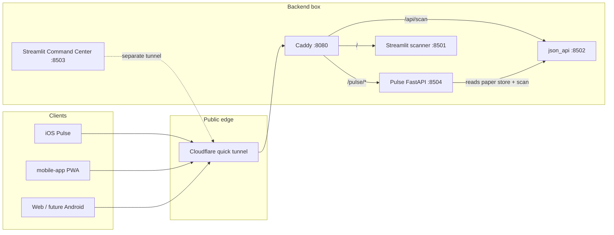

# Project Money — Backend Server Contract

**Audience:** any agent (or human) building iOS / Android / web clients or extending scanners.

**Canonical runtime:** the Grok Bot shared Linux box (Chief of Staff / Project Money bots).
Clients **must not** run scanners locally for production feeds — they call this backend over HTTPS.

Educational / **paper trading only**. No live order placement via these APIs.

## Architecture



## Ports (on the box)

| Port | Process | Role |
|------|---------|------|
| **8080** | **Caddy** | Public reverse proxy. **Must stay Caddy** — see `stock-data-scanner/LIVE_PROXY.md`. Never put `proxy_server.py` (aiohttp) on 8080 in production. |
| 8501 | Streamlit Stock Data Scanner | Human UI |
| 8502 | Scan JSON API | `/api/scan`, `/scan-latest.json` |
| 8503 | Streamlit Options Seller Command Center | Human UI (often separate tunnel) |
| **8504** | **Pulse FastAPI** (`options-seller/api`) | Mobile/JSON backend under `/pulse` |

## Public URL model

- One **BACKEND_BASE** host (Caddy via tunnel), e.g. `https://….trycloudflare.com`
- Pulse clients use **`{BACKEND_BASE}/pulse`** (no trailing slash)
- Scan feed also at **`{BACKEND_BASE}/api/scan`** (and mirrored at `{BACKEND_BASE}/pulse/api/scan`)
- Tunnel URLs are **ephemeral** — see [`LIVE_URLS.md`](./LIVE_URLS.md)

### Client config

- **iOS:** `ios-app/Pulse/Config.swift` → `AppConfig.baseURL = "{BACKEND_BASE}/pulse"`
- **PWA:** same-origin `/api/*` when served under `/pulse`, or point fetch base at `{BACKEND_BASE}/pulse`

## Pulse HTTP API (`options-seller/api/main.py`)

All routes work at `/api/...` on :8504 and at `/pulse/api/...` via Caddy.

| Method | Path | Notes |
|--------|------|-------|
| GET | `/api/news` | RSS headlines + product ideas (iOS News tab); `?refresh=true` |
| GET | `/api/health` | Liveness; includes `scan_feed_reachable` |
| GET | `/api/risk/status` | Paper book risk vs **$50k** hard cap; soft warn **80% ($40k)** |
| GET | `/api/scan` | Proxy/fallback to scan envelope (`stock-data-scanner.scan/v0.1`) |
| GET | `/api/portfolio/summary` | Account value, PnL, greeks est. |
| GET | `/api/portfolio/positions` | Open positions |
| GET | `/api/portfolio/activity` | Recent activity |
| GET | `/api/insights/celebrity` | Celebrity-priority insights |
| GET | `/api/insights/earnings` | Earnings window insights |
| GET | `/api/insights/volatility` | Vol insights |
| GET | `/api/candidates` | Strategy candidates from scan + portfolio |
| GET | `/api/quote/{symbol}?range=` | Cached quote bars |
| GET | `/docs` | OpenAPI (FastAPI) — hit `:8504/docs` on the box |

CORS: permissive `*` for GET/POST (mobile may use a dedicated base URL).

Errors: handlers prefer HTTP 200 with `{"error": "..."}` for data problems (mobile never blank-screens).

### Example curls

```bash
BASE=https://views-pill-radical-templates.trycloudflare.com   # update from LIVE_URLS.md

curl -sS "$BASE/pulse/api/health" | jq .
curl -sS "$BASE/pulse/api/risk/status" | jq '{status,aggregate_open_risk,headroom,utilization_pct}'
curl -sS "$BASE/api/scan" | jq '{schema,asOf,n:(.results|length)}'
curl -sS "$BASE/pulse/api/scan" | jq '{schema,asOf}'
curl -sS "$BASE/pulse/api/portfolio/summary" | jq .
curl -sS "$BASE/pulse/api/candidates" | jq '.[0:3]'
```

## Scan schema

See `stock-data-scanner/SCHEMA.md`. Envelope `schema`: **`stock-data-scanner.scan/v0.1`**.
Celebrity badges use `markers.celebrityPriority` on results.

## How to run on the backend box

```bash
# Scan JSON API (8502) + Streamlit scanner (8501) + Caddy (8080)
# (Project Money bots / keep-alive scripts usually own this)

# Pulse API
cd /workspace/options-seller   # or repo checkout path on the box
./api/run.sh                   # 127.0.0.1:8504

# Caddy must include /pulse → 8504 (see stock-data-scanner/Caddyfile)
caddy reload --config stock-data-scanner/Caddyfile --adapter caddyfile
```

Local laptop dev: run Pulse + point `BASE` at localhost, or use demo fallbacks built into `mobile-app`.

## Risk rules (paper)

- **Hard max** aggregate open risk: **$50,000**
- **Soft warn** at 80% ($40,000)
- Risk per position: `max_loss` if set, else `capital`
- Open positions only; breaches can be trimmed via CLI `options-seller risk enforce` / dashboard Risk tab
- Executor may mark `risk_rejected` when a new plan would breach

## Hard rules for agents

1. **Do not** displace Caddy on `:8080` with aiohttp `proxy_server.py`.
2. Streamlit WebSocket needs `Sec-WebSocket-Protocol: streamlit` through the tunnel.
3. Prefer **PRs / small commits**; unexpected UI drawers/restarts may be from an external ChatGPT agent with write+relaunch rights — coordinate, don’t fight.
4. Paper only — never wire live brokerage order APIs without an explicit human ask.
5. Update [`LIVE_URLS.md`](./LIVE_URLS.md) when tunnels rotate; bump iOS `AppConfig.baseURL`.

## Related paths in repo

| Path | Purpose |
|------|---------|
| `options-seller/api/` | Pulse FastAPI |
| `options-seller/src/options_seller/risk/` | Risk limits / enforce |
| `stock-data-scanner/` | Scanner + JSON API + Caddyfile |
| `stock-data-scanner/LIVE_PROXY.md` | Why Caddy stays on 8080 |
| `mobile-app/` | PWA client |
| `ios-app/` | SwiftUI Pulse client |
